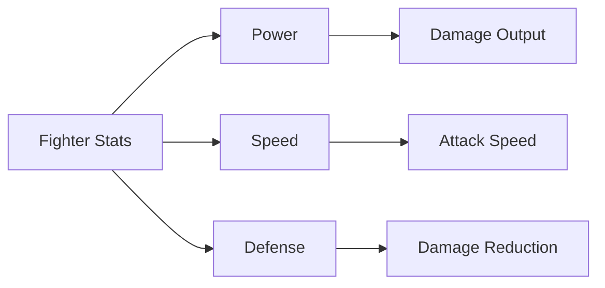
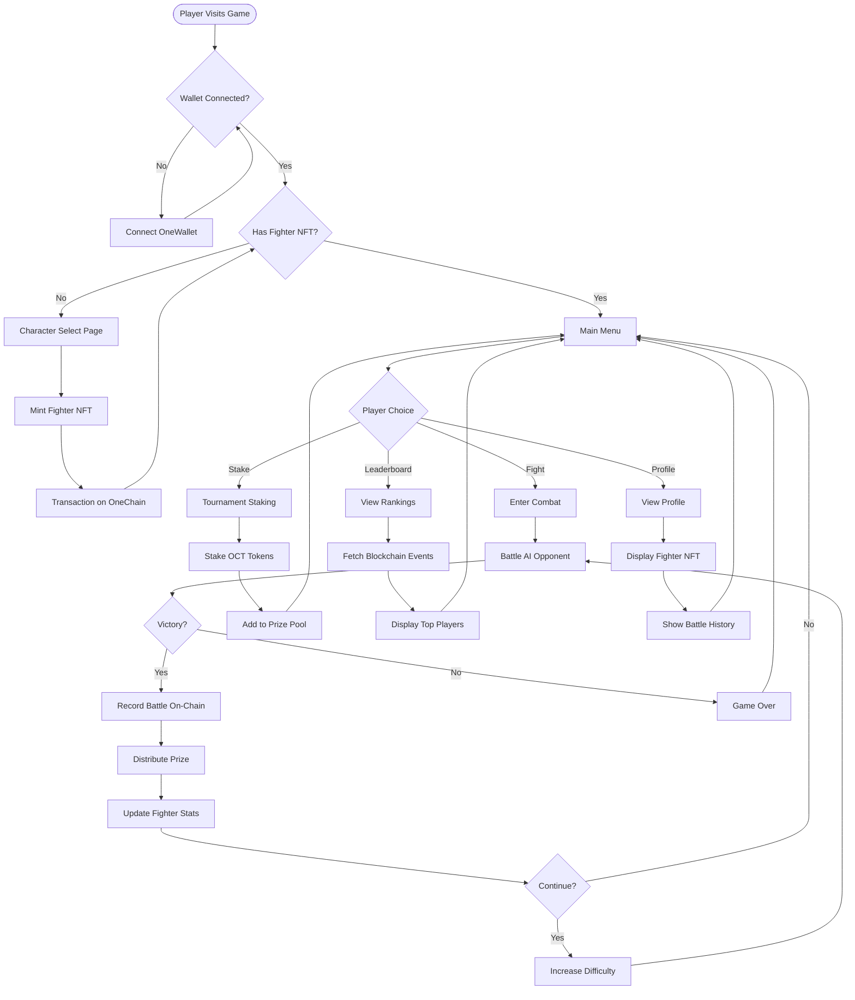
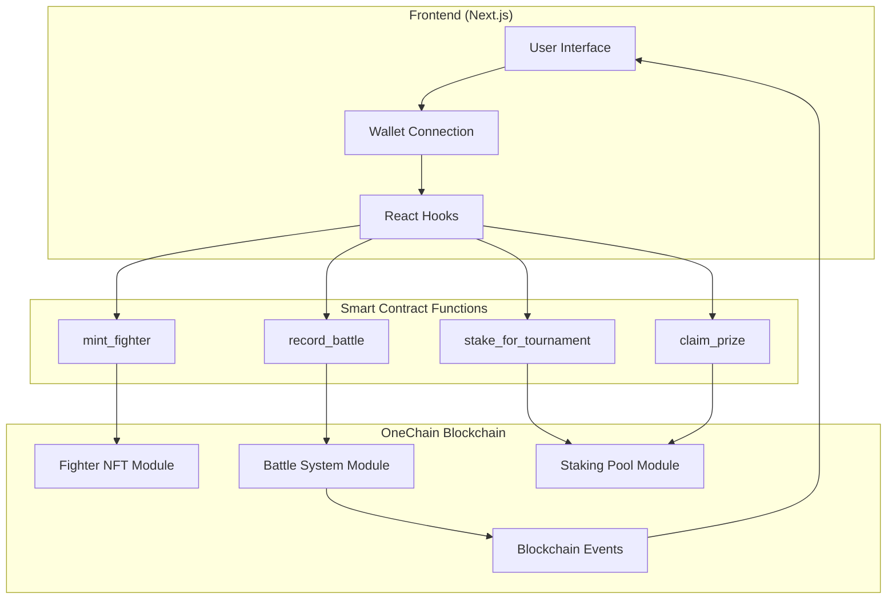
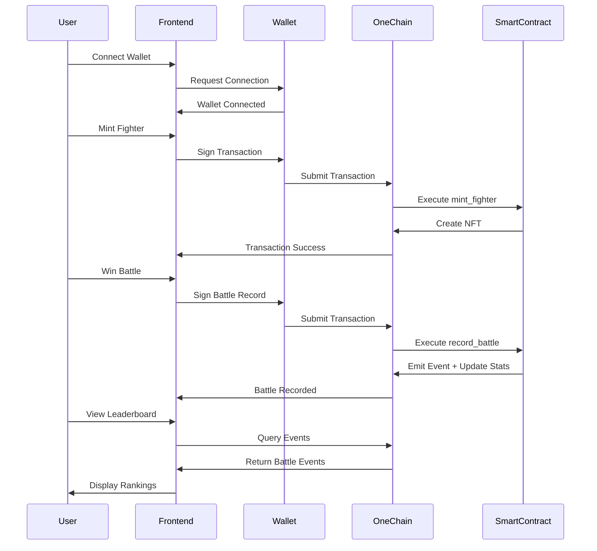

# 🥊 ONE CLASH FIGHTERS:

> **A blockchain-powered retro fighting game on OneChain**  
> Play-to-Earn • NFT Fighters • On-Chain Battles • Tournament Staking

[](https://onelabs.cc)
[](https://nextjs.org)
[](https://www.typescriptlang.org)
[](LICENSE)

---

## 📖 Table of Contents

- [Overview](#overview)
- [Game Features](#game-features)
- [How to Play](#how-to-play)
- [Fighter Roster](#fighter-roster)
- [Game Workflow](#game-workflow)
- [OneChain Integration](#onechain-integration)
- [Smart Contracts](#smart-contracts)
- [Installation](#installation)
- [Tech Stack](#tech-stack)
- [Architecture](#architecture)

---

## 🎮 Overview

**One Clash Fighters** is a retro-style fighting game that combines classic arcade gameplay with modern blockchain technology. Built on **OneChain**, players mint unique Fighter NFTs, battle AI opponents, stake OCT tokens in tournaments, and earn rewards based on their performance—all recorded immutably on-chain.

### Key Highlights
- 🎨 **NFT Fighters**: Mint and own unique fighter characters as NFTs
- ⚔️ **On-Chain Battles**: Every victory is recorded on the blockchain
- 💰 **Play-to-Earn**: Stake tokens, win battles, claim prizes
- 🏆 **Live Leaderboard**: Real-time rankings from blockchain events
- 🔗 **Fully Decentralized**: All game logic secured by smart contracts

---
## Gallery 
### Home Page 


### Select character 


### You Won 


### Save Record in BLockchain


### 


### Main Fight 


### LeaderBord 


### Stacking 


### Stacking on OneChain


## 🌟 Game Features

### Core Gameplay
- **6 Unique Fighters** with distinct stats and abilities
- **Progressive Difficulty** - AI gets stronger each round
- **Advanced Combat System** - Punch, kick, jump, duck, defense, and special moves
- **Retro Pixel Art** - Classic arcade aesthetics
- **Responsive Controls** - Smooth keyboard-based combat

### Blockchain Features
- **Fighter NFT Minting** - Create your fighter on-chain
- **Battle Recording** - All victories stored on OneChain
- **Tournament Staking** - Stake OCT tokens to enter prize pools
- **Prize Distribution** - Winners claim rewards automatically
- **Transparent Leaderboard** - Rankings verified on blockchain
- **Profile System** - View your NFT fighter and battle history

---

## 🎯 How to Play

### 1️⃣ **Connect Wallet**
- Click "Connect Wallet" on the home screen
- Connect your OneWallet (OneChain compatible wallet)

### 2️⃣ **Mint Your Fighter**
- Navigate to "Character Select"
- Choose from 6 unique fighters
- Mint your fighter NFT (small fee required)

### 3️⃣ **Enter Combat**
- Select your minted fighter
- Battle against AI opponents
- Use strategic moves to win

### 4️⃣ **Stake & Earn**
- Visit the "Staking" page
- Stake OCT tokens to enter tournaments
- Win battles to increase your prize pool share

### 5️⃣ **Track Progress**
- Check the "Leaderboard" for rankings
- View your "Profile" to see stats and battle history

---

## 🥋 Fighter Roster

Each fighter has unique stats that affect combat performance:



### Fighter Details

| Fighter | Type | Power | Speed | Defense | Specialty |
|---------|------|-------|-------|---------|-----------|
| ⚡ **Thunder Fist** | Boxer | 9 | 6 | 7 | Heavy punches, high damage |
| 🥷 **Shadow Strike** | Ninja | 7 | 10 | 5 | Lightning fast, swift combos |
| 🤖 **Cyber Warrior** | Tech | 8 | 8 | 6 | Balanced, precision strikes |
| 🎭 **Mystery Fighter** | Enigma | 6 | 7 | 9 | Unpredictable, defensive |
| 👑 **Street King** | Brawler | 7 | 7 | 8 | Well-rounded, solid fundamentals |
| 🛡️ **Iron Wall** | Tank | 8 | 5 | 10 | Defensive powerhouse, unbreakable |

### Combat Controls

| Key | Action | Description |
|-----|--------|-------------|
| **←/→** | Move | Walk left/right |
| **↑** | Jump | Leap over attacks |
| **↓** | Duck | Avoid high kicks |
| **D** | Punch | Quick attack (5 damage) |
| **A** | Kick | Strong attack (10 damage) |
| **S** | Defense | Block incoming damage (1% only) |
| **↑ + A** | Jump Kick | Aerial special (15 damage) |

---

## 🔄 Game Workflow



---

## 🔗 OneChain Integration

### Blockchain Architecture



### How It Works

1. **Fighter NFT System**
   - Each fighter is a unique NFT on OneChain
   - Stores stats: name, type, level, wins, losses, damage
   - Minted via `fighter_nft::create_fighter` function
   - Owned by player's wallet address

2. **Battle Recording**
   - Every battle result is recorded on-chain
   - Emits `BattleCompleted` event with winner, damage, prize
   - Updates fighter stats (wins, losses, total damage)
   - Creates immutable `BattleRecord` object

3. **Tournament Staking**
   - Players stake OCT tokens to enter tournaments
   - Tokens added to shared prize pool
   - Winners claim 90% of pool (10% burned for APY)
   - All transactions verified on blockchain

4. **Leaderboard System**
   - Fetches `BattleCompleted` events from blockchain
   - Aggregates wins, damage, and prizes per player
   - Real-time rankings updated automatically
   - Fully transparent and verifiable

---

## 📜 Smart Contracts

The game uses three Move smart contract modules deployed on OneChain:

### 1. Fighter NFT Module (`fighter_nft.move`)
```move
// Creates unique fighter NFTs with stats
public entry fun create_fighter(
    name: vector<u8>,
    fighter_type: u8,
    power: u8,
    speed: u8,
    defense: u8,
    ctx: &mut TxContext
)
```

**Features:**
- Mint fighter NFTs with custom stats
- Track wins, losses, level, and damage
- Update stats after each battle
- Transfer ownership between wallets

### 2. Battle System Module (`battle_system.move`)
```move
// Records battle results on-chain
public entry fun record_battle(
    fighter: &mut Fighter,
    winner_damage: u64,
    loser_damage: u64,
    prize: Coin<OCT>,
    round: u64,
    ctx: &mut TxContext
)
```

**Features:**
- Record single-player and PvP battles
- Emit `BattleCompleted` events for leaderboard
- Distribute prize tokens to winners
- Create immutable battle records

### 3. Staking Pool Module (`staking_pool.move`)
```move
// Stake tokens for tournament entry
public entry fun stake_for_tournament(
    pool: &mut TournamentPool,
    stake: Coin<OCT>,
    ctx: &mut TxContext
)
```

**Features:**
- Shared tournament prize pool
- Track total staked and prize pool
- Entry fee: 0.01 OCT (configurable)
- Winners claim 90% of pool

### Contract Deployment

The contracts are deployed on **OneChain Testnet**. To deploy your own:

```bash
# Navigate to Move contracts
cd move

# Build contracts
one move build

# Publish to OneChain
one client publish --gas-budget 100000000
```

After deployment, update `lib/onechain-config.ts` with your package and pool IDs.

---

## 🚀 Installation

### Prerequisites
- Node.js 18+ and npm
- OneWallet browser extension
- OneChain testnet OCT tokens (from faucet)

### Setup Steps

1. **Clone the repository**
```bash
git clone https://github.com/yourusername/one-clash-fighters.git
cd one-clash-fighters
```

2. **Install dependencies**
```bash
npm install
```

3. **Configure environment (optional)**
```bash
# Create .env.local file
NEXT_PUBLIC_PACKAGE_ID=your_package_id
NEXT_PUBLIC_TOURNAMENT_POOL_ID=your_pool_id
```

4. **Run development server**
```bash
npm run dev
```

5. **Open in browser**
```
http://localhost:3000
```

### Build for Production
```bash
npm run build
npm start
```

---

## 🛠️ Tech Stack

### Frontend
- **Framework**: Next.js 14 (App Router)
- **Language**: TypeScript 5
- **Styling**: Tailwind CSS
- **UI Components**: Custom retro-styled components
- **State Management**: React Hooks

### Blockchain
- **Network**: OneChain Testnet
- **Smart Contracts**: Move Language
- **Wallet Integration**: @mysten/dapp-kit
- **SDK**: @mysten/sui (OneChain compatible)
- **Token**: OCT (OneChain native token)

### Development Tools
- **Package Manager**: npm
- **Linting**: ESLint
- **Type Checking**: TypeScript
- **Version Control**: Git

---

## 🏗️ Architecture

### Project Structure
```
one-clash-fighters/
├── app/                    # Next.js app directory
│   ├── page.tsx           # Home/menu page
│   ├── select/            # Character selection
│   ├── fight/             # Combat gameplay
│   ├── winner/            # Battle results
│   ├── leaderboard/       # Rankings page
│   ├── staking/           # Tournament staking
│   └── profile/           # User profile
├── components/            # React components
├── hooks/                 # Custom React hooks
│   ├── use-fighter-nft.ts
│   ├── use-battle-recording.ts
│   └── use-staking.ts
├── lib/                   # Utilities and config
│   ├── onechain-config.ts
│   ├── fighters.ts
│   └── game-utils.ts
├── move/                  # Smart contracts
│   └── sources/
│       ├── fighter_nft.move
│       ├── battle_system.move
│       └── staking_pool.move
├── providers/             # Context providers
└── public/                # Static assets
```

### Data Flow



---

## 🎨 Game Mechanics

### Combat System
- **Hit Detection**: Precise collision boxes for each fighter
- **Damage Calculation**: Based on fighter power stat and move type
- **Defense Mechanism**: Blocking reduces damage to 1%
- **Special Moves**: Jump kicks deal 50% more damage
- **AI Behavior**: Adaptive difficulty with strategic decision-making

### Progression System
- **Difficulty Scaling**: Each round increases AI damage by 20%
- **Fighter Leveling**: Win battles to increase fighter level
- **Stat Tracking**: Cumulative damage dealt and taken
- **Win/Loss Record**: Permanent on-chain history

### Economy
- **Mint Fee**: 0.001 OCT per fighter NFT
- **Entry Fee**: 0.01 OCT to stake in tournaments
- **Prize Pool**: 90% distributed to winners, 10% burned
- **Battle Rewards**: Variable based on performance

---

## 📊 Leaderboard Metrics

Rankings are calculated from blockchain data:

1. **Total Wins** - Number of victories
2. **Total Damage** - Cumulative damage dealt
3. **Total Prize** - OCT tokens earned
4. **Last Battle** - Timestamp of most recent fight

All data is fetched from `BattleCompleted` events emitted by smart contracts.

---

## 🤝 Contributing

Contributions are welcome! Please follow these steps:

1. Fork the repository
2. Create a feature branch (`git checkout -b feature/amazing-feature`)
3. Commit your changes (`git commit -m 'Add amazing feature'`)
4. Push to the branch (`git push origin feature/amazing-feature`)
5. Open a Pull Request

---

## 📄 License

This project is licensed under the MIT License - see the [LICENSE](LICENSE) file for details.

---

## 🔗 Links

- **OneChain**: [https://onelabs.cc](https://onelabs.cc)
- **OneChain Docs**: [https://docs.onelabs.cc](https://docs.onelabs.cc)
- **OneChain Faucet**: Get testnet OCT tokens
- **OneWallet**: Browser extension for OneChain

---

## 🙏 Acknowledgments

- OneChain team for blockchain infrastructure
- Next.js team for the amazing framework
- Retro gaming community for inspiration

---

<div align="center">

**Built with ❤️ on OneChain**

*Fight. Earn. Dominate.*

</div>
